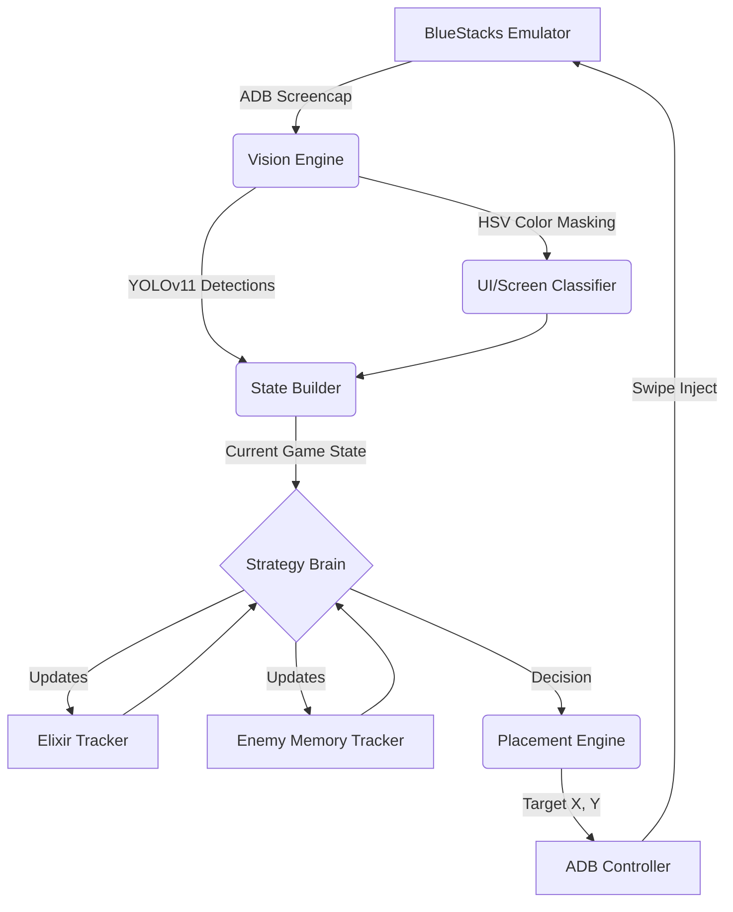

# 🏆 TITAN S-Class: Autonomous Clash Royale AI


TITAN is a highly advanced, fully autonomous AI agent capable of playing Clash Royale in real-time. It uses **Computer Vision (YOLOv11)** to perceive the battlefield, an **Asynchronous Pipeline** for zero-latency screen reading, and a **Grandmaster Rule-Based Expert System** to execute macros, combos, and kiting.

## ✨ Features

- **👀 Real-Time Vision**: A custom-trained YOLOv11s model trained on 100+ hours of Clash Royale gameplay to detect 103 distinct classes (troops, spells, buildings, UI elements).
- **🧠 Grandmaster Intelligence**:
  - **Memory Tracker**: Automatically maps the opponent's 8-card deck and predicts their cycle.
  - **Elixir Management**: Tracks enemy elixir usage in the background to calculate when to strike with an Elixir Advantage.
  - **Dynamic Kiting**: Drops squishy troops in the center of the arena to pull heavy tanks (like PEKKA) into the opposite lane.
- **⚡ Asynchronous Architecture**: The AI perception thread and the game-state engine run asynchronously, ensuring the decision loop runs flawlessly at 30+ FPS.
- **🤖 Live Emulator Injection**: Native ADB (Android Debug Bridge) integration to read the live screen from BlueStacks and inject ultra-fast swipe commands.

---

## 🏗 System Architecture

The AI is decoupled into several highly specialized modules:



## 🚀 Getting Started

### Prerequisites
- Python 3.10+
- BlueStacks 5 (or any Android Emulator supporting ADB)
- `adb` added to your system PATH.

### 1. Installation
Clone the repository and install the dependencies:
```bash
git clone https://github.com/krish/TITAN.git
cd TITAN
pip install -r requirements.txt
```

### 2. Emulator Setup
1. Open BlueStacks Settings -> Advanced -> Enable **Android Debug Bridge (ADB)**.
2. Note the port (default is usually `127.0.0.1:5555`).

### 3. Run TITAN
Start a Clash Royale match against a trainer or real player, then launch TITAN:
```bash
python play_live.py
```
TITAN will automatically connect to ADB, process the live video feed, and begin deploying cards to win the match.

---

## 🔬 Dataset & Training
The vision model was trained from scratch using a highly optimized data engineering pipeline:
- **Batch Extractor**: Parsed 20GB+ of 1080p MP4 gameplay footage, extracting frames at regular intervals.
- **Auto-Labeler**: Bootstrapped early datasets using active learning routing (rejecting low-confidence frames for manual review).
- **No-Flip Augmentation**: Specifically trained *without* horizontal flipping to preserve lane geometry (left vs. right).

## 👨‍💻 Author
Built by a passionate AI engineer to explore the limits of computer vision, real-time asynchronous processing, and expert-system game theory.

---

## 🚧 Current WIP Status

Please note that several modules are currently empty stubs or works-in-progress, and will be completed in a future release:
- **`learning/`**: Contains infrastructure for deep reinforcement learning (e.g., `vector_state.py`) but RL training itself is not currently active (the system uses the `Grandmaster` rule-based engine instead).
- **`vision/yolo_model.py`**: The YOLO object detection stub needs to be connected to the real model weights.
- **`engine/mock_state.py`**: Currently a stub used for offline testing.
- **`tests/`**: Unit tests are currently empty stubs.