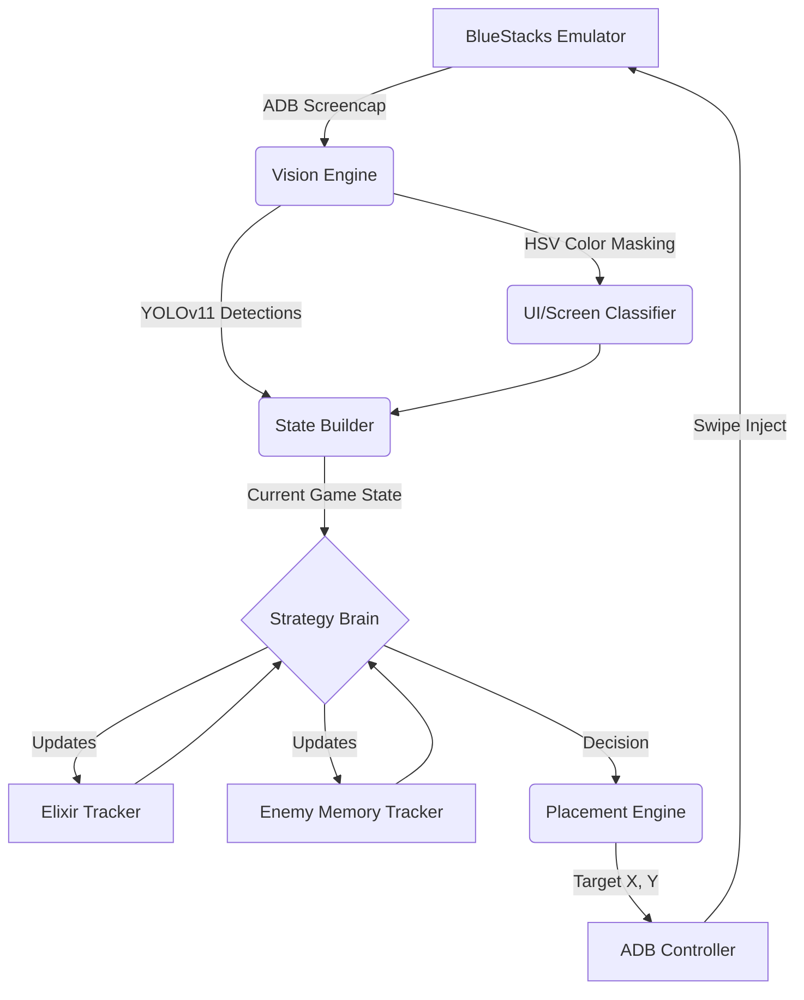

# 🏆 TITAN S-Class: Autonomous Clash Royale AI


TITAN is a highly advanced, fully autonomous AI agent capable of playing Clash Royale in real-time. It uses **Computer Vision (YOLOv11)** to perceive the battlefield, an **Asynchronous Pipeline** for zero-latency screen reading, and a **Grandmaster Rule-Based Expert System** to execute macros, combos, and kiting.

## ✨ Features

- **👀 Real-Time Vision**: A custom-trained YOLOv11s model trained on 100+ hours of Clash Royale gameplay to detect 103 distinct classes.
- **🧠 Grandmaster Intelligence**:
  - **Memory Tracker**: Automatically maps the opponent's 8-card deck and predicts their cycle.
  - **Elixir Management**: Tracks enemy elixir usage in the background.
  - **Dynamic Kiting**: Drops squishy troops in the center of the arena to pull heavy tanks.
- **⚡ Asynchronous Architecture**: The AI perception thread and the game-state engine run asynchronously.
- **🤖 Live Emulator Injection**: Native ADB (Android Debug Bridge) integration to read the live screen from BlueStacks.

---

## 🏗 System Architecture

The AI is decoupled into highly specialized modules, ensuring clean separation of concerns for vision, strategy, and execution:



## 🚀 Getting Started

### Prerequisites
- Python 3.10+
- BlueStacks 5 (or any Android Emulator supporting ADB)
- `adb` added to your system PATH.
- **Tesseract OCR**: You must install the Tesseract system binary. 
  - **Windows**: Download from [UB-Mannheim](https://github.com/UB-Mannheim/tesseract/wiki) and add to PATH.

### 1. Installation
Clone the repository and install the dependencies:
```bash
git clone https://github.com/krishbindal/TITAN.git
cd TITAN
pip install -r requirements.txt
```

### 2. Model Downloads
The `best.pt` YOLOv11s model weights are required for vision to function.
- You can download the model weights from the [GitHub Releases Page](#) (link coming soon).
- Place `best.pt` inside the `models/` directory in the root of the project.

### 3. Emulator & ADB Setup
1. Open BlueStacks Settings -> Advanced -> Enable **Android Debug Bridge (ADB)**.
2. Note the port (default is usually `127.0.0.1:5555`).

**Dynamic ADB Ports (Troubleshooting)**
If you are using BlueStacks 5 Multi-Instance, LDPlayer, or Nox, your emulator might assign a dynamic 5-digit port (e.g., `5557`, `59841`).
- To find your exact port, open your terminal and run: `adb devices`
- If your device shows up as `127.0.0.1:59841`, you must update the ADB configuration in TITAN to connect to this port. If `adb devices` shows multiple devices, ensure only your target emulator is running.

### 4. Run TITAN
Start a Clash Royale match against a trainer or real player, then launch TITAN:
```bash
python play_live.py
```
TITAN will automatically connect to ADB, process the live video feed, and begin deploying cards to win the match.

---

## 🛠 Common Troubleshooting

- **"No device found" / ADB Connection Refused**: Run `adb kill-server` followed by `adb devices`. Ensure the emulator has ADB enabled in settings.
- **Extremely Low FPS / Laggy Capture**: Ensure BlueStacks is running on the primary monitor. Avoid minimizing the emulator window, as Windows may throttle its rendering.
- **Tesseract Not Found Error**: Ensure the Tesseract installation folder (e.g., `C:\Program Files\Tesseract-OCR`) is added to your Windows Environment Variables `PATH`.

## 👨‍💻 Author
Built by a passionate AI engineer to explore the limits of computer vision, real-time asynchronous processing, and expert-system game theory.